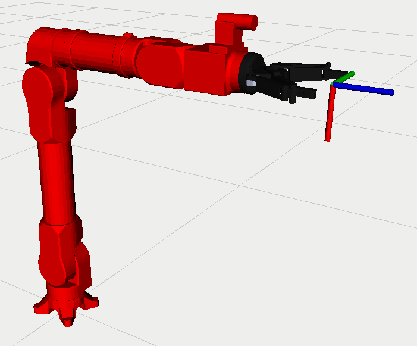

# ovis_description

This repo contains the URDF description for Ovis arm.



## Dependecies
This package requires robotiq's robotiq_2f_140_gripper_visualization available at [https://github.com/ros-industrial/robotiq].

## To test with RViz
```
roslaunch ovis_description display_robot.launch
```